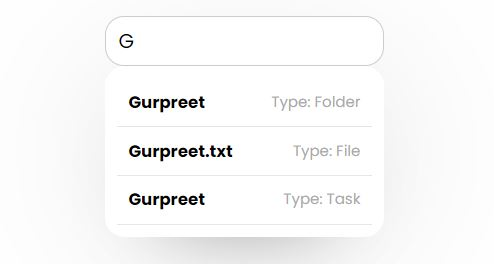
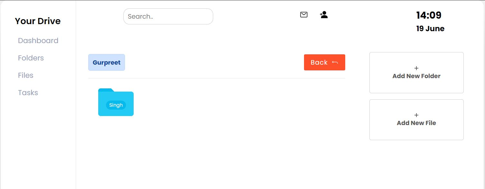
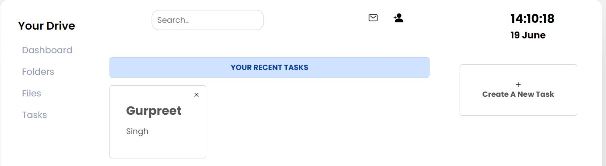

## Mini Drive

Mini drive is a web application that allows us to upload folders, files, where we can rename and delete them. I also created a task manager that is implemented with this mini drive where we can create our daily tasks, this web application is built with Html, css, JavaScript and Nodejs.

## Design

```
https://www.uidesigndaily.com/posts/sketch-project-management-dashboard-projects-to-do-list-menu-day-1162
```

## Folder Icons
```
http://jlizanab.github.io/FFolders/ 
```

### Install node dependencies

```
npm install
```

### Start server

```
npm start
```

### Run supervised server

Watch server for changes and restarts it if necessary

```
npm run supervisor
```

## Captures

Home Page


Search Bar



Folders Page



Task Manager


